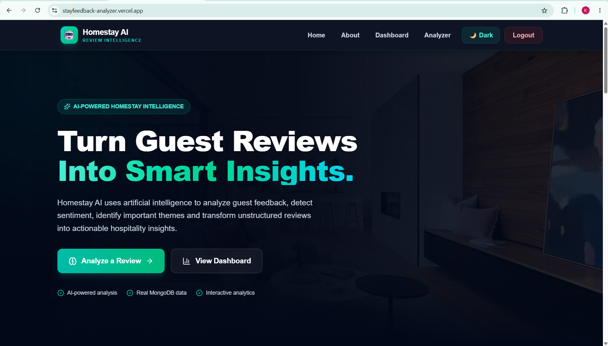
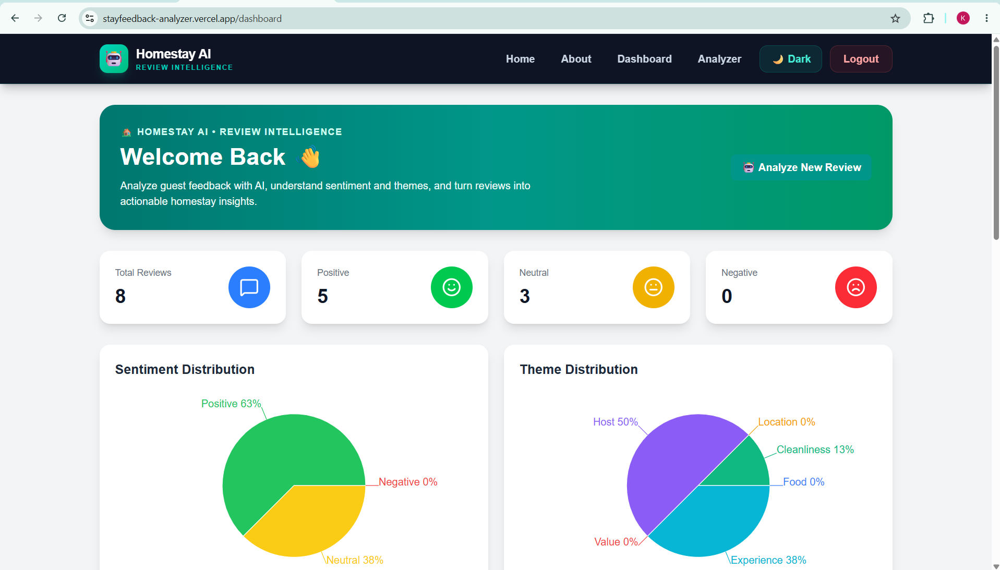
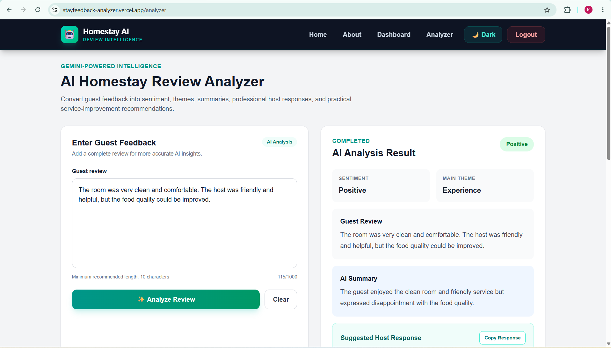
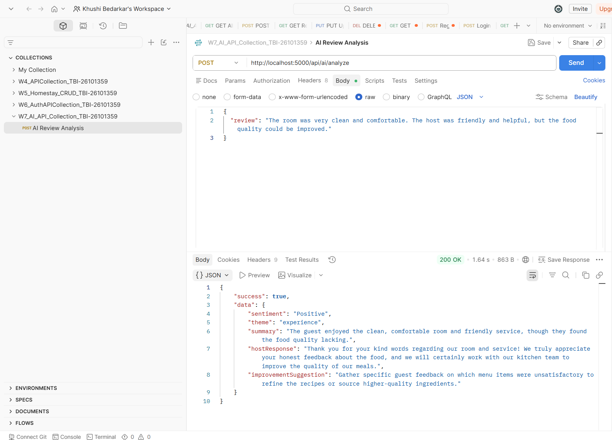

# StayFeedback Analyzer

**StayFeedback Analyzer** is an AI-powered full-stack web application that helps homestay businesses understand guest feedback quickly. It analyzes guest reviews using Google Gemini AI and presents useful insights such as sentiment, review theme, summary, suggested host response, and improvement suggestions.

This project was developed as part of the **TBI-GEU AI-Assisted Full Stack Web Development Internship**.

---

## 1. Live Project

**Frontend:** https://stayfeedback-analyzer.vercel.app

**GitHub Repository:** https://github.com/KHUSHIBEDARKAR/stayfeedback-analyzer

**Backend:** https://stayfeedback-analyzer.onrender.com

---

## 2. Problem Statement

Homestay businesses receive guest reviews that contain useful information about cleanliness, food, hosts, location, service, and the overall stay.

Reading and analysing every review manually can be time-consuming, and important feedback may be missed.

StayFeedback Analyzer was built to make this process easier by using AI to convert unstructured guest reviews into simple, actionable information.

---

## 3. What the Application Does

A user can enter a guest review and receive an AI-generated analysis.

For example, a review such as:

> "The room was very clean and comfortable. The host was friendly and helpful, but the food quality could be improved."

can be analysed to provide:

- Sentiment
- Main theme
- Short summary
- Professional host response
- Improvement suggestion

The application also allows authenticated users to manage saved reviews through CRUD operations.

---

## 4. Features

### Review Management

- Create reviews
- View saved reviews
- View review details
- Update reviews
- Delete reviews
- Search reviews
- Store review data in MongoDB

### AI Review Analysis

- Google Gemini AI integration
- Sentiment analysis
- Main theme detection
- AI-generated review summary
- Professional host response
- Practical improvement suggestion
- Structured AI response
- Loading state while analysis is running
- Error handling for failed AI requests

### Authentication & Security

- User registration
- User login
- JWT authentication
- Protected routes
- Password hashing using bcrypt
- Input validation
- Rate limiting
- Google authentication
- Secure environment variables
- CORS configuration

### Dashboard & UI

- Review statistics
- Sentiment distribution
- Theme distribution
- Monthly review trend
- Recent reviews
- Responsive interface
- Dark/light mode
- Reusable React components

---

## 5. Tech Stack

### Frontend

- React
- Vite
- React Router
- Tailwind CSS
- JavaScript
- Recharts
- Fetch API

**Why:** React provides reusable components and a clean way to build the application's pages and user interactions. Vite provides a fast development environment, while Tailwind CSS was used for responsive styling.

### Backend

- Node.js
- Express.js
- REST APIs

**Why:** Express provides a simple and reliable way to build the backend APIs and connect the frontend with the database and AI service.

### Database

- MongoDB Atlas
- Mongoose

**Why:** MongoDB provides flexible document-based storage and works well with the review data used by this application. MongoDB Atlas also provides cloud-hosted persistence.

### Authentication & Security

- JSON Web Token (JWT)
- bcrypt/bcryptjs
- express-validator
- express-rate-limit
- Passport.js
- Express Session

### AI

- Google Gemini API

**Why:** Gemini is used to understand guest reviews and generate structured, useful feedback for homestay management.

### Deployment

- Vercel — Frontend
- Render — Backend
- MongoDB Atlas — Database

---

## 6. Screenshots

The following screenshots show the main parts of the application.

### Home Page



### Dashboard



### AI Review Analyzer



### API Testing



---

## 7. Application Architecture

The application follows a simple full-stack architecture:

```text
                    User
                      |
                      v
             React Frontend
                 (Vercel)
                      |
                      v
              Express REST API
                 (Render)
                /          \
               /            \
              v              v
       MongoDB Atlas      Gemini API
          Database             AI
```

### Application Flow

1. The user opens the React application.
2. The user registers or logs in.
3. Authentication protects user-specific features.
4. The user manages guest reviews through the dashboard.
5. A review can be submitted to the AI analyzer.
6. The frontend sends the review to the Express backend.
7. The backend securely communicates with Gemini.
8. Gemini returns structured analysis.
9. The backend sends the result back to the frontend.
10. The frontend displays the sentiment, theme, summary, host response, and improvement suggestion.

---

## 8. Project Structure

```text
stayfeedback-analyzer/
│
├── backend/
│   ├── config/
│   │   ├── db.js
│   │   └── passport.js
│   │
│   ├── middleware/
│   │   └── verifyToken.js
│   │
│   ├── models/
│   │   ├── Review.js
│   │   └── User.js
│   │
│   ├── routes/
│   │   ├── authRoutes.js
│   │   └── aiRoutes.js
│   │
│   ├── .env.example
│   ├── package.json
│   └── server.js
│
├── docs/
│   └── schema.png
│
├── public/
│
├── src/
│   ├── assets/
│   ├── components/
│   │   ├── ui/
│   │   ├── Card.jsx
│   │   ├── Footer.jsx
│   │   ├── Hero.jsx
│   │   ├── Navbar.jsx
│   │   └── ProtectedRoute.jsx
│   │
│   ├── context/
│   │   └── ThemeContext.jsx
│   │
│   ├── pages/
│   │   ├── About.jsx
│   │   ├── Dashboard.jsx
│   │   ├── Home.jsx
│   │   ├── Login.jsx
│   │   ├── Register.jsx
│   │   └── ReviewAnalyzer.jsx
│   │
│   ├── App.jsx
│   ├── main.jsx
│   └── index.css
│
├── screenshots/
│   ├── 01_Homepage.png
│   ├── 03_Dashboard.png
│   ├── 04_AI_Analysis.png
│   └── 05_API_Test_200OK.png
│
├── PROMPTS.md
├── README.md
├── package.json
└── vite.config.js
```

> Keep this section synchronized with the actual repository structure if a folder or file has a different name.

---

## 9. API Documentation

The application uses REST APIs for authentication, review management, and AI analysis.

### Authentication APIs

| Method | Endpoint | Purpose |
|---|---|---|
| POST | `/api/auth/register` | Register a new user |
| POST | `/api/auth/login` | Login and receive authentication information |

### Review APIs

| Method | Endpoint | Purpose |
|---|---|---|
| GET | `/api/reviews` | Get reviews |
| GET | `/api/reviews/:id` | Get a single review |
| POST | `/api/reviews` | Create a review |
| PUT | `/api/reviews/:id` | Update a review |
| DELETE | `/api/reviews/:id` | Delete a review |
| GET | `/api/reviews/search?q=keyword` | Search reviews |

### AI API

| Method | Endpoint | Purpose |
|---|---|---|
| POST | `/api/ai/analyze` | Analyse a guest review using Gemini AI |

---

## 10. AI Feature

### Gemini-Powered Review Analysis

The main AI feature is the **AI Homestay Review Analyzer**.

### Example Input

```json
{
  "review": "The room was very clean and comfortable. The host was friendly and helpful, but the food quality could be improved."
}
```

### Example Output

```json
{
  "success": true,
  "data": {
    "sentiment": "Positive",
    "theme": "experience",
    "summary": "The guest enjoyed the clean, comfortable room and friendly service, although the food quality could be improved.",
    "hostResponse": "Thank you for your kind words regarding our room and service. We appreciate your feedback about the food and will work to improve the quality of our meals.",
    "improvementSuggestion": "Gather specific feedback about the menu items and improve food quality where needed."
  }
}
```

The exact AI response can vary depending on the review.

### AI Workflow

```text
Guest Review
     |
     v
React Frontend
     |
     v
POST /api/ai/analyze
     |
     v
Express Backend
     |
     v
Google Gemini API
     |
     v
Structured AI Response
     |
     v
React UI
```

The Gemini API key is kept on the backend through environment variables instead of being exposed in the frontend.

---

## 11. Prompt Engineering

The project contains a `PROMPTS.md` file documenting the prompt development process.

It includes:

- Prompt variations
- Prompt structure
- Expected AI output
- Final selected prompt
- Reason for selecting the final prompt

The final prompt asks Gemini to return structured JSON so that the frontend can reliably display the AI results.

---

## 12. Database Schema

### User Collection

| Field | Type | Purpose |
|---|---|---|
| `_id` | ObjectId | Unique user ID |
| `email` | String | User email |
| `password` | String | Hashed password |
| `createdAt` | Date | Creation timestamp |
| `updatedAt` | Date | Last update timestamp |

### Review Collection

| Field | Type | Purpose |
|---|---|---|
| `_id` | ObjectId | Unique review ID |
| `text` | String | Guest review |
| `sentiment` | String | Positive, Neutral, or Negative |
| `theme` | String | Main review theme |
| `response` | String | Suggested host response |
| `createdAt` | Date | Creation timestamp |
| `updatedAt` | Date | Last update timestamp |

---

## 13. Installation & Setup

### Prerequisites

Make sure the following are installed:

- Node.js
- npm
- Git
- MongoDB Atlas account
- Google Gemini API access

### 1. Clone the repository

```bash
git clone https://github.com/KHUSHIBEDARKAR/stayfeedback-analyzer.git
cd stayfeedback-analyzer
```

### 2. Install frontend dependencies

From the project root:

```bash
npm install
```

### 3. Install backend dependencies

```bash
cd backend
npm install
```

### 4. Create environment variables

Create:

```text
backend/.env
```

Use your own values:

```env
PORT=5000
MONGO_URI=YOUR_MONGODB_CONNECTION_STRING
FRONTEND_URL=http://localhost:5173
JWT_SECRET=YOUR_JWT_SECRET
GEMINI_API_KEY=YOUR_GEMINI_API_KEY
GOOGLE_CLIENT_ID=YOUR_GOOGLE_CLIENT_ID
GOOGLE_CLIENT_SECRET=YOUR_GOOGLE_CLIENT_SECRET
```

For the deployed backend, use the production frontend URL for `FRONTEND_URL`.

**Never commit `.env` to GitHub.**

### 5. Start the backend

```bash
cd backend
npm run dev
```

The backend normally runs on:

```text
http://localhost:5000
```

### 6. Start the frontend

Open another terminal at the project root:

```bash
npm run dev
```

Open the local Vite URL shown in the terminal, normally:

```text
http://localhost:5173
```

---

## 14. Security

The project includes several security measures:

- Password hashing
- JWT authentication
- Protected routes
- Input validation
- Rate limiting
- CORS configuration
- Environment variables for secrets
- `.env` excluded from Git
- API keys are not exposed in frontend code

Sensitive credentials should never be committed to the repository.

---

## 15. Testing

The application was tested across the main user flows.

### UI Testing

- Desktop layout
- Tablet layout
- Mobile layout
- Login flow
- Dashboard
- Review analyzer
- Dark/light mode

### Backend Testing

- Authentication APIs
- Review CRUD APIs
- Search API
- AI analysis API
- MongoDB persistence

### AI Testing

The AI endpoint was tested using Postman.

A successful test returned:

```text
200 OK
```

with structured AI analysis containing sentiment, theme, summary, host response, and improvement suggestion.

---

## 16. Deployment

### Frontend

The React frontend is deployed on **Vercel**.

Live URL:

https://stayfeedback-analyzer.vercel.app

### Backend

The Express backend is deployed on **Render**.

Live backend URL:

**Add your actual Render URL here.**

### Database

MongoDB Atlas is used as the cloud database.

### Production Configuration

The deployment uses environment variables for:

- Database connection
- JWT secret
- Gemini API key
- Google OAuth credentials
- Frontend URL

The frontend communicates with the deployed backend through the configured API URL.

---

## 17. Known Limitations

- AI results depend on the availability and response of the Gemini API.
- AI-generated responses should be reviewed by a human before being used as official communication.
- Free-tier hosting can have cold-start delays after inactivity.
- AI API usage may be affected by provider rate limits.
- More advanced analytics can be added in future versions.

---

## 18. Future Improvements

Possible future improvements include:

- Multi-language review analysis
- Batch review analysis
- Advanced sentiment classification
- Review trend prediction
- More detailed analytics
- Admin dashboard
- CSV/PDF report export
- Email notifications
- AI confidence scoring
- Automated monthly reports
- Improved search and filtering
- Unit and integration testing

---

## 19. Internship Learning Reflection

This project gave me practical experience in building a complete full-stack application instead of working only on individual technologies.

During the internship, I learned how to connect a React frontend with an Express backend, store application data in MongoDB, implement authentication, build and test REST APIs, integrate a generative AI service, and deploy the application to the cloud.

One of the most useful parts of the internship was learning how to debug real application issues such as CORS configuration, environment variables, database connectivity, authentication and deployment problems.

Overall, the internship helped me understand how different parts of a modern web application work together as one complete product.

---

## 20. Credits & Acknowledgements

This project was developed as part of the **TBI-GEU AI-Assisted Full Stack Web Development Internship**.

I used official documentation, learning resources, development tools, and AI-assisted tools during the development and debugging process.

Special thanks to the TBI-GEU Skill Development Team for providing the internship structure and weekly development tasks.

---

## 21. Author

**Khushi Bedarkar**

B.Tech — Computer Science & Engineering (AI & ML)

Graphic Era (Deemed to be University), Dehradun

**GitHub:**  
https://github.com/KHUSHIBEDARKAR/stayfeedback-analyzer

**Live Project:**  
https://stayfeedback-analyzer.vercel.app
